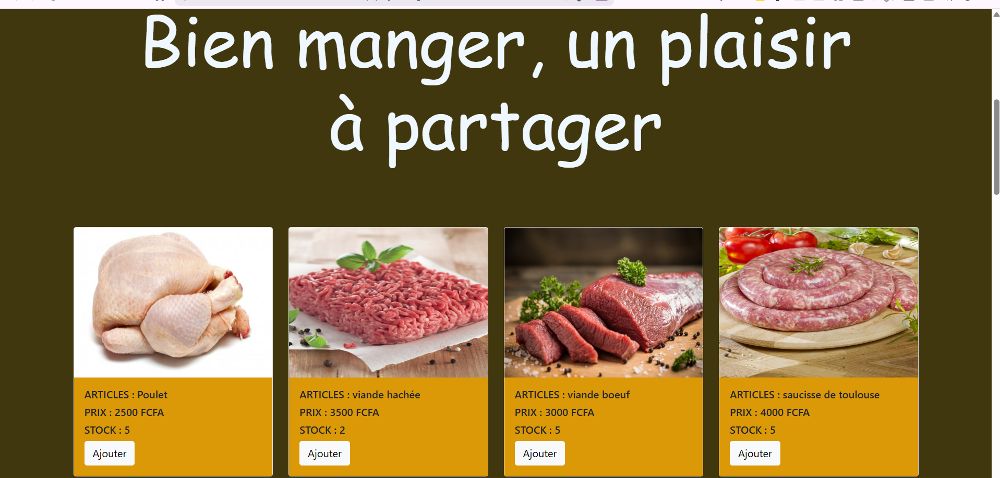
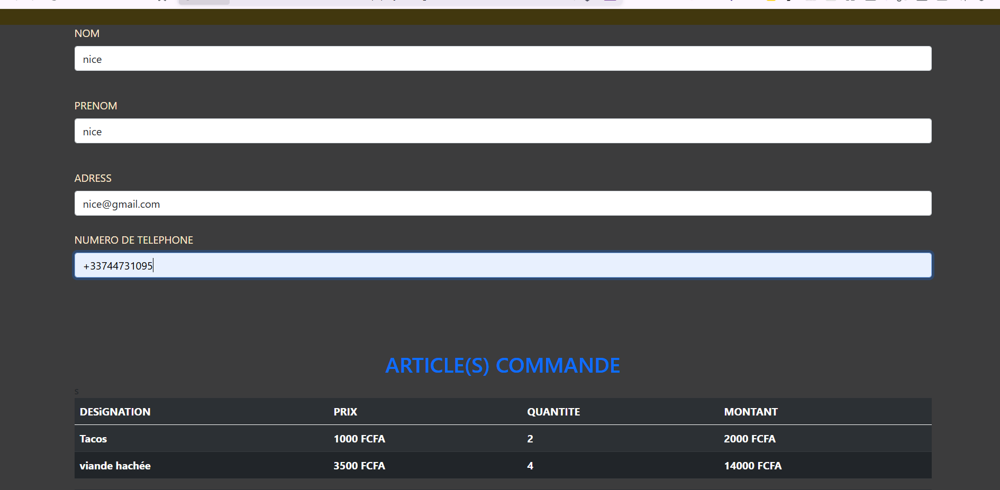
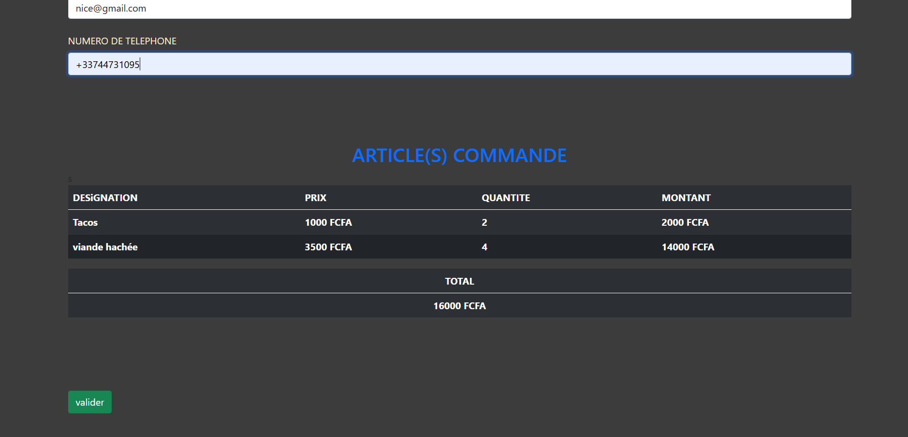

# 🛒 Projet de Gestion de Panier

## 📚 Contexte

Ce projet a été réalisé dans le cadre de **l'examen de JavaScript** en **première année** durant l'année académique **2020 – 2021**.

L'objectif principal était de mettre en pratique les bases du **JavaScript**, ainsi que l'intégration avec **HTML**, **CSS** et **Bootstrap**, à travers une application web simple et fonctionnelle.

---

## 🎯 Objectifs du projet

* Afficher une liste d’articles
* Ajouter des articles dans un panier
* Gérer le panier (quantité, total)
* Passer une commande
* Générer automatiquement une **facture** après validation de la commande

---

## ⚙️ Fonctionnalités

* 📦 Liste d’articles disponibles à l’achat
* ➕ Ajout d’articles au panier
* 🛒 Affichage du panier avec le total
* ❌ Suppression d’articles du panier
* 🧾 Génération d’une facture après la commande
* 💻 Interface responsive grâce à Bootstrap

---

## 🛠️ Technologies utilisées

* **HTML5**
* **CSS3**
* **JavaScript (Vanilla JS)**
* **Bootstrap**

---

## 🖼️ Captures d’écran

Voici quelques aperçus de l’application :

* Image 1 : page d’accueil avec la liste des articles
  

* Image 2 : ajout des articles au panier
  

* Image 3 : affichage du panier et du total
  

* Image 4 : facture générée après la commande
  

---

## 🚀 Lancement du projet

1. Cloner le dépôt GitHub
2. Ouvrir le fichier `index.html` dans un navigateur web
3. Utiliser l’application directement (aucune installation requise)

---

## 📌 Remarques

* Le projet a été réalisé **sans framework JavaScript** afin de bien comprendre les bases
* Toute la logique métier est gérée en JavaScript

---

## 👨‍🎓 Auteur

Projet réalisé par **Glenn Leonard**
Étudiant – Première année
Année académique **2020 – 2021**

---

✅ Projet pédagogique réalisé dans un cadre académique.
